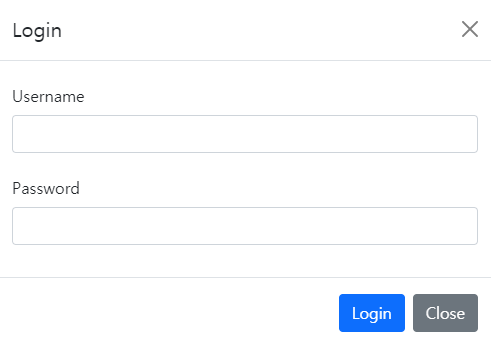

# Django 프로젝트  (pjt [#])


## 작성법

- 폴더와 파일명은 영문으로 작성한다.
- [Github-Flavoured Markdown](https://guides.github.com/features/mastering-markdown/) 으로 작성하며 파일 확장자명은 `.md`
- 짧고 간결하며 핵심적인 문장을 사용한다.
- 필요한 설명이 있으면 관련된 정보가 포함된 외부 링크를 사용 하자.

---


##### problem A.

- **조건** :  
  - #
  
- **결과**
  - #

<u>**구현한 것**</u> : #

**<u>필요했던 점</u>** : #

**<u>알고 있던 점</u>** : #

**<u>모르고 있던 점</u>** : #


---

##### problem B.

- **조건** :
  - #
  
- **결과** :
  - #


**<u>구현한 것</u>** : #

**<u>필요했던 점</u>** : #

**<u>알고 있던 점</u>** : #

**<u>모르고 있던 점</u>** : #

---

## 코드 첨부

description


##### problem A.

```python

```


## 사진 첨부

ex)



---

### 총평

ex)

내가 너무 바보인가? 아니면 컴퓨터가 너무 똑똑한가? html 좋다. css 좋다 거기까지 괜찮았어.  이거저거 배우는거 맘에 들어. 근데 

###        &#128545;왜?&#128545;

컴퓨터 너 죽을래? 맘 같아서는 컴퓨터고 뭐고 다 부시고 나갈 뻔(라고 할뻔 &#128013;)                              |&#128064; ?
