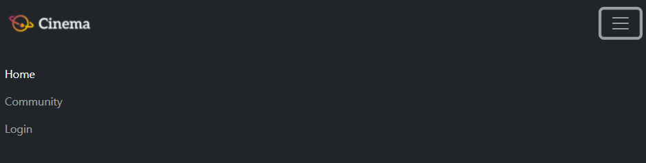
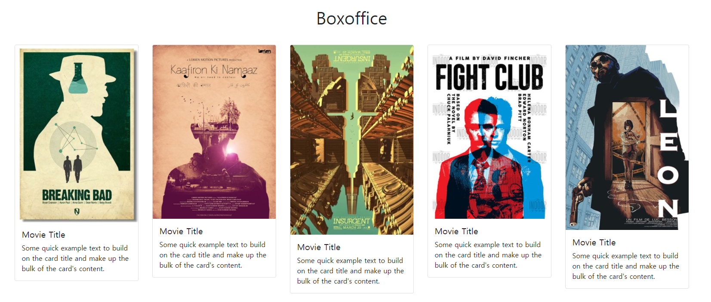
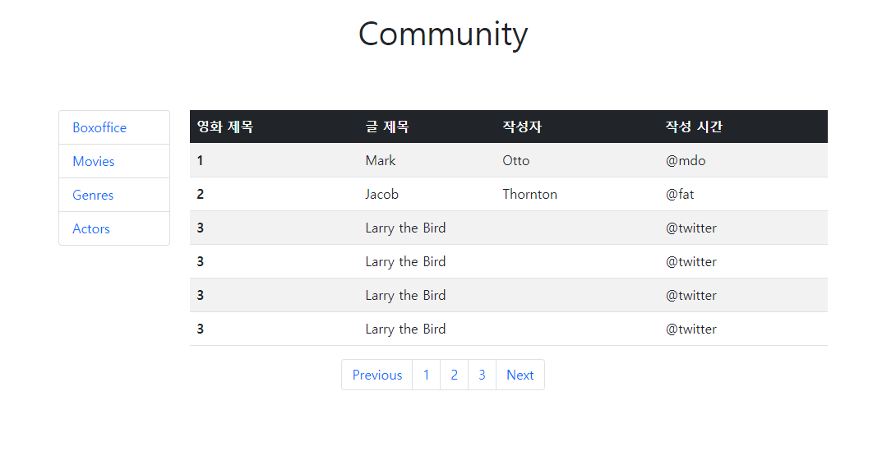
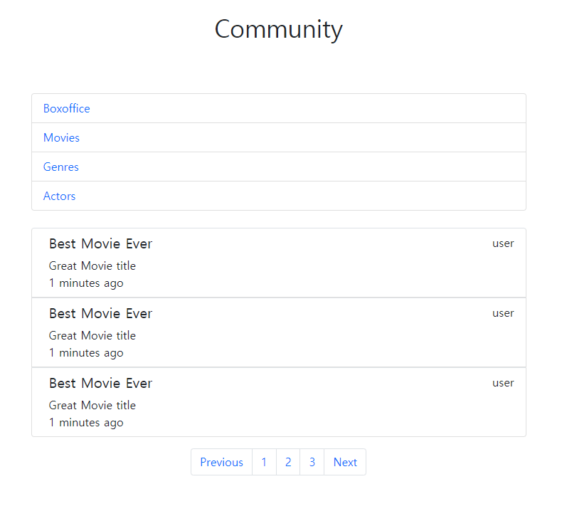

# 관통 프로젝트 \#3 (pjt03) ; 반응형 웹 페이지 구성


## 작성법

- 폴더와 파일명은 영문으로 작성한다.
- [Github-Flavoured Markdown](https://guides.github.com/features/mastering-markdown/) 으로 작성하며 파일 확장자명은 `.md`
- 짧고 간결하며 핵심적인 문장을 사용한다.
- 필요한 설명이 있으면 관련된 정보가 포함된 외부 링크를 사용 하자.

---


### 총평

내가 너무 바보인가? 아니면 컴퓨터가 너무 똑똑한가? html 좋다. css 좋다 거기까지 괜찮았어.  이거저거 배우는거 맘에 들어. 근데 

###        &#128545;왜?&#128545;

컴퓨터 너 죽을래? 맘 같아서는 컴퓨터고 뭐고 다 부시고 나갈 뻔(라고 할뻔 &#128013;)                              |&#128064; ?

---


##### 1. 01_nav_footer

네비게이션 바를 구현하는데 있어 가장 중요한 부분은 얼마만큼의 크기를 가질 것인지, 어떤 역할을 수행하게 할 것인지로 구별된다고 생각한다. 여기서 가장 중요한 것은 class단위를 사용하여 네비게이션 바가 제 역할을 수행할 수 있게 하는 것이었다. 실제로 좌측 상단 로고, 우측 상단의 Home, Community, Login 버튼 세개를 만드는 것 뿐인데 상당한 시간이 필요했다. 이유도 모르는 이유로 space-between이 자동으로 적용되어 있는 것을 보고는 개발자 도구를 사용해 이것저것 뜯어보며 이를 익힐 수 밖에 없었다. 물론! `bootstrap.css` 를 직접 뜯어봐도 확인할 수 있을 것이었지만 말이다. 실제로 inline으로 style을 정의하면 굉장히 쉬워보일 것 같..지만!! 실제로 마음대로 작동되는 것은 그렇게 많지 않았다. 결국 엄청나게 많은 시행착오를 거쳐가며 이를 구현하는 방법밖엔 없었던 것 같다.(이걸 어떻게 한번에 뚝딱뚝딱 쳐..&#128545;)


길고 긴 서론을 지나 결론부터 말하자면, 구현하는데 성공했다.(그러니까 이거 쓰겠지만) 우여곡절이 없다면 거짓말이고 고개를 서른마흔 다섯만번쯤은 넘었던 것 같다. 명세 없이 이런 모양정도로 만들어 주세요 보다는 확실히 정확한 오더가 있는 것이 조금 편한 것 같기도 하다.


###### 구현

대부분의 코드를 `bootstrap docs`의 example에서 따왔다. 

일정 픽셀 이하로 사이즈가 작아지면 아래와 같이 햄버거 버튼이 나온다 


이 버튼이 활성화되면 아래와 같이 주루룩 내려온다.



이보다 큰 픽셀의 경우에는, 이를 한번에 보여주도록 구현하였는데,

아래 그림은 위의 그림보다 더 큰 픽셀의 상황을 나타내는 그림이다.


이는 정확히 768px 전후로 나뉘게 되는데, 

```html
class= "navbar-expand-md"
//에서 이를 구현했다
```

로그인 버튼을 누르게 되면 다음과 같은 모달(modal)이 나온다.


만들고도 참 뿌듯했다..!!


마지막으로,

```html
<footer>
    <footer class="fixed-bottom h6 text-secondary row align-items-center mt-0">
      <p class="text-center mb-3">Web-bootstrasp PJT, by 강민수</p>
    </footer>
  </footer>
```

이와 같은 코드를 통해 footer를 구현해내는데 성공했다.


##### 2. 02_home

웹 사이트의 가장 기본이 되는 홈 화면이다. 이는 1번에서 구현한 네비게이션 바를 항상 포함하고 있으며, 헤더 부분에는 주루룩 넘어가는 Carousel 컴포넌트로 이루어져있다.(생각보다 신기하다.) 키보드 오른쪽, 왼쪽 버튼의 입력으로 사진이 넘어가기도 하고, 아무튼 뭐랄까 음.. 세번째 사진의 첫 번째 영화가 야해서 좋았다(?)


헤더 부분의 아래에는 영화의 정보를 담고 있는 카드들을 구현해야했다. 총 6장의 카드를 row-column으로 나열하여 breakpoint마다 몇 개의 영화를 보여주게 될 지를 구현해내는 부분이었다. 그중에 조커 영화 포스터가 있어서 좋았던 것 같다.

> I thougt my life was a tragedy, but it was a fucking comedy.
>
> 내 인생이 비극인 줄 알았는데, 알고 보니 코미디었어..


룰루랄라..&#128513;


###### 구현

- carousel

bootstrap의 carousel의 example에서 큰 틀을 가져왔다. header에 이를 담아내어 표현하도록 하였고, 이 부분은 크게 어려움이 없었다.


>야하다.
>
>야해.
>
>매우.

`좋..다(style="font-size: 1px")`

- card-list

card-list를 만들어 breakpoint마다 다른 개수의 카드를 보여주도록 하는 것을 구현했다. 이는 (미소누나)의 도움이 매우 컸다. `flex-sm-row`나, `flex-sm-wrap`과 같은 클래스를 알고나서 이를 정렬하는데 굉장히 편했다.



^^!


##### 3. 03_community

갓갓 `d-none`으로 모든 것을 해결했다.

꺄르륵..@)))))

breakpoint 전후로 다르게 보이도록 구현했고, 이에도 (미소누나)의 도움이 매우 컸다..



사이즈가 클 때는 이렇게 나오다가~~



이렇게 나온다!! 아,.,,., 너무 행복했다..


마지막으로, home과 community의 href를 연결했다. 끝!
