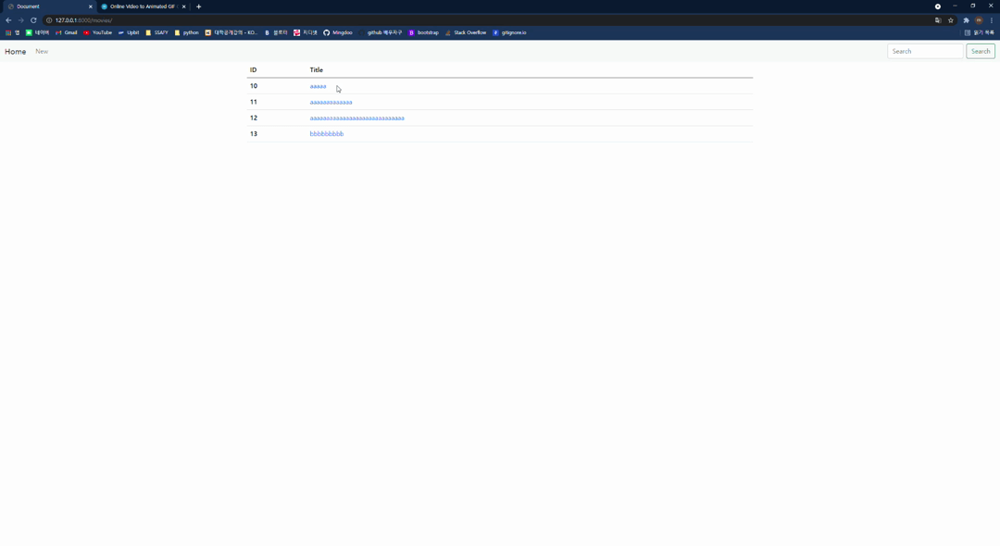
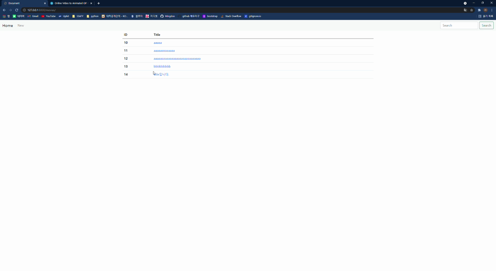

# PJT04

#### 총평

- 정미소) 이번주 내내 공부했던 내용을 바탕으로 CRUD 기능을 가진 게시판 페이지를 구현할 수 있었다. url 을 받아 view를 통해 model에 데이터를 저장하고 view를 통해 보여지는 templates를 관리하는 흐름을 정확하게 이해한다면 어렵지 않은 프로젝트였다. 하지만 Django가 없다면 이러한 기능을 혼자서 구현할 수 있을지 걱정도 되었다.  우선은 Django를 통해 웹페이지가 만들어지는 과정과 실제 웹페이지가 동작하는 흐름을 정확하게 이해할 수 있도록 복습해야될 것 같다.
- 강민수) Django를 배우며 MVC를 이용한 CRUD 기능을 구현하는데 성공했다. `python`언어를 사용하여 `django` 라는 써드 파티 앱을 사용해 웹 페이지를 구현하였는데, url을 통해 요청이 오면  `urls.py`가 이를 받아 `views.py`에 전달하여 요청을 처리하는데, `db.sqlite3`에 있는 데이터를 불러와서 사용자에게 이를 `template`를 통해 보여주도록 구현했다. 추가로 CRUD 기능에 `R`부분에서 Search라는 기능을 추가하여 검색값을 입력하면 이 입력값에 따른 결과를 보여주는 기능을 추가로 구현했다.

#### 목적

- 영화 제목 / 줄거리 / 포스터 내용을 확인/작성/수정/삭제할 수 있는 게시판 페이지 구현하기

#### 구현방법

- Framework : `Django`
- Front-end library : `Bootstrap`
- `HTML`, `CSS`, `Python`

#### 기능

- Index : 작성된 전체 게시글들의 제목을 확인 할 수 있는 기능
- New : 새로운 게시글을 작성할 수 있는 기능
- Detail : 글 제목을 선택하면 세부 글 내용을 볼 수 있는 기능
- Edit : 글 제목 및 내용을 수정할 수 있는 기능
- Delete : 글을 삭제할 수 있는 기능
- Search : 원하는 키워드가 포함된 제목을 검색할 수 있는 기능

#### 실행화면

#### Index / Detail

#### New

#### Edit

#### Delete

#### Search

