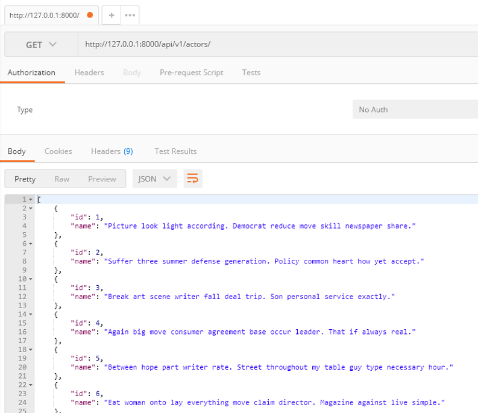

pjt08

---

- ### 목표

  - 데이터를 생성, 조회, 수정, 삭제할 수 있는 `Web application` 제작
  - `DRF`(Django Rest Framework)를 활용한 API Server 제작
  - Database 1:N, M:N 관계의 이해와 데이터 관계 설정


- ### 요구사항

  - 커뮤니티 서비스의 상세 기능 개발을 위한 단계로, 모델간의 관계 설정 후 데이터의 생성, 조회, 수정, 삭제할 수 있는 기능을 완성합니다. 데이터의 조회는 JSON 양식을 따릅니다.

  - #### 프로젝트 구조

    - pjt08/은 startproject 명령어로 생성되는 project 디렉토리입니다.
    - movies/는 startapp 명령어로 생성되는 application 디렉토리입니다.


- #### Model

  


- #### 구현한 것

  - `Models.py`에서 `Actor`, `Review`, `Movie` class와 1:N 관계, N:M 관계
  - `serializer`를 통한 직렬화, `json` 포맷의 응답 구현
  - `REST` 아키텍처 원칙을 준수한 api
  - `rest framework`를 통한 `RESTful api` 구현

  

  - #### 기능

    - `Actor`, `Review`, `Movie`의 수정/삭제/생성/조회

    - `admin` 페이지를 통한 데이터 수정/삭제/생성/조회
    - 요청에 따른 http status code 전송(`200, 204, 404`)
    - Postman을 통한 api 테스트(`기능은 아님`)

---

#### 총평

REST를 제안해주신 `로이 필딩`님께 정말 감사합니다.. :smile:

- Wikipedia : [REST](https://ko.wikipedia.org/wiki/REST)

`RESTful api`란? http 프로토콜 위에서 세워져야 할 아키텍처의 원칙으로 URI로 이루어진 자원과 http method로 이루어진 행위를 구분하는 api를 말합니다.

근데.. 생각보다.. 어렵다.. :cry:

`Serializer`를 통해 `Json` 형태로 보내주는 방법이다. Web api를 사용할 때 request를 보내고, response를 받는 과정(챗봇 만들기) 때 했던 방법이 이렇게 이루어진다는 것을 알았다.(사실 카카오 2차 코테볼때도 알아야했음.)

```python
#in serializers.py
class ActorListSerializer(serializers.ModelSerializer):
    class Meta:
        model = Actor
        fields = ('id','name',)
```

이런 식으로 작성해야 한다. (class Meta 를 안써서 고생했음. 눈 부릅뜨고 확인하자)

serializer 클래스 내에서 새로운 클래스를 선언해서 `id`에 해당하는 `title`을 참조하여 serialize하는 것을 구현했습니다.

- review를 불러올 때, movie data도 같이 불러옴(`id`만 불러오는 것이 아니라 `title`도 불러올 수 있게 됨)

> 개발자를 위한 개발이 이런거구나.. 라는 것을 깨닫게 된 프로젝트였습니다..


---

#### 상세 내용

1. Actor

- 조회



- 생성


- 수정

1. Before


2. After


- 삭제


2. Movie

- 생성


- 수정

1. Before


2. After


- 삭제


3. Review

- 생성


- 수정

1. Before


2. After


- 삭제


