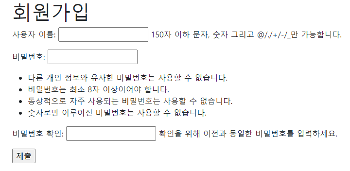
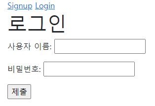
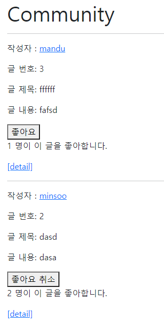
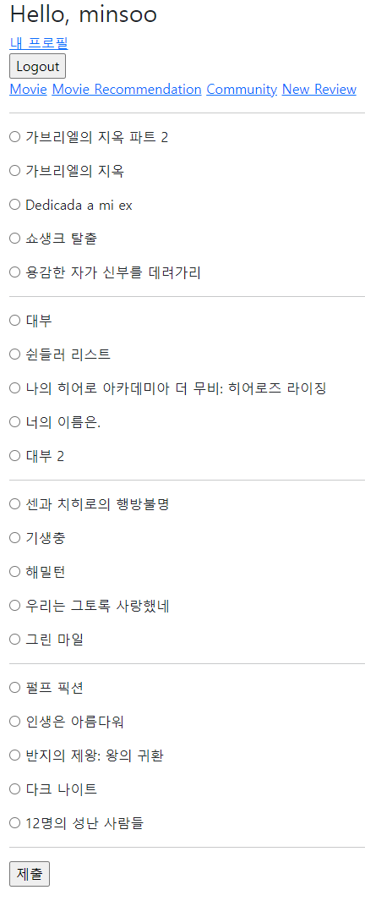

# Pjt09

1. #### 목표

- 데이터를 생성, 조회, 수정, 삭제할 수 있는 Web Application 제작
- AJAX 통신과 JSON 구조에 대한 이해
- Database 1:N, M:N 관계의 이해와 데이터 관계 설정
- 영화 추천 알고리즘 설계


2. #### 요구사항

- 유저 팔로우 기능
  - 팔로우 버튼을 클릭하는 경우, `AJAX`통신을 이용하여 서버에서 JSON데이터를 받아와 상황에 맞게 HTML화면을 구성합니다.
- 리뷰 좋아요 기능
  - 좋아요 버튼을 클릭하는 경우, `AJAX`통신을 이용하여 서버에서 JSON데이터를 받아와 상황에 맞게 HTML화면을 구성합니다.

- Movie app

  - 사용자의 인증 여부와 관계없이 전체 영화 목록 조회 페이지에서 적절한 UI를 활용하여 영화 목록을 제공합니다.
  - 사용자의 인증 여부와 관계없이 단일 영화 상세 조회 페이지에서 적절한 UI를 활용하여 영화 정보를 제공합니다.

- ### 영화 추천 기능

  - 사용자가 인증되어 있다면, 적절한 알고리즘을 활용하여 10개의 영화를 추천하여 제공합니다.


3. #### 구현

<u>**구현한 것**</u> : 

  1. 유저 팔로우 기능 : 1번 유저가 2번 유저를 팔로우 할 경우, `AJAX`통신을 사용하여 서버에서 JSON데이터를 받아 이를 javascript를 통해 html dom을 조작하는 기능(새로고침의 필요가 없음.)
      	1. 자기 자신을 팔로우할 수 없게 구현(서버에서 구현)
   2. 리뷰 좋아요 기능 : 1번 유저가 2번 유저의 게시글을 좋아요를 클릭하면, `AJAX`통신을 사용해 서버에서 JSON데이터를 통해 javascript로 dom을 조작
       	  	1. 여러개의 리뷰를 모두 `forEach`메소드로 `EventHandling`을 구현하였음.
 3. 무한 스크롤 : 스크롤을 내릴 때마다 새로운 영화가 갱신되는 방법(`Django Pagination`)
   4. 영화 추천 기능 : 사용자가 선택한 영화와 같은 영화의 장르를 10개를 별점 높은 순서대로 보여주는 방식
    5. `Movie`와 `Genre` 서로간의 참조를 통해 영화/장르를 얻어와 이를 context에 전달하여 표시

**<u>구현하지 못한 것</u>** :

1. Bootstrap을 통한 예쁜 페이지 : 시간이 부족한 관계로..
   1. 최종 프로젝트에는 영혼을 갈아넣겠습니다. :smile:

2. review 내의 모든 button을 id로 `eventHandling`하는 것.(class로 구현하였음.)


4. ## 총평

어렵지만 즐거운 프로젝트였습니다. 팀원과 같이 페어 프로그래밍을 하면서 항상 느끼는 것이, 내가 모르는 것을 상대가 알 수도 있고, 내가 아는 것을 상대가 모를 수도 있다는 것. 그리고 더 좋은 방법을 모색하고자 한다는 점에 있어 페어 프로그래밍의 장점이 뚜렷하게 보였습니다.

구현하는 과정 중, javascript의 axios와 python django를 사용하였는데, `AJAX`요청을 통해 사용자에게 지속적인 새로고침을 요구하지 않고 javascript로 이를 처리한다는 점에서 큰 매력을 느꼈습니다.


## 구현 내용

초기 데이터 삽입

```shell
python manage.py loaddata {filename}.json
```

### Account

1. #### Signup



Django에서 제공하는 `UserCreationForm`을 상속받아 `CustomUserCreationForm`으로 유저 생성

 2. #### Login



Django login Form을 사용한 로그인 폼

3. #### Profile


4. #### Follower / Following


자기 자신은 팔로우 할 수 없음.


### Review




### Movies

1. infinite scroll

- clientHeight, scrollHeight, scrollTop을 사용하여 스크롤에 `eventHandling`을 사용

```javascript
let pageNum = 1
    document.addEventListener('scroll', () =>{
      const {clientHeight, scrollHeight, scrollTop} = document.documentElement
      if (clientHeight + Math.round(scrollTop) === scrollHeight){
        pageNum += 1
        axios({
          method: 'get',
          headers: {
            'x-requested-with' : 'XMLHttpRequest'
          },
          url: `?page=${pageNum}`,
        })
          .then((res) => {
            const myList = document.querySelector('#list')
            res.data.forEach((data) => {
              const newDiv = document.createElement('div')
              const newHtml = `
                <h3>${ data.fields.title }</h3>
                <p>${ data.fields.overview }</p>
                <p><a href="${data.pk}">[detail]</a></p>
              `
              newDiv.innerHTML = newHtml
              myList.appendChild(newDiv)
            })
          })
      }
    })
```

여기서,

```javascript
if (clientHeight + Math.round(scrollTop) === scrollHeight)
```

부분이 스크롤이 맨 아랫 부분에 닿았는지를 판단한다. 다만, 글의 마지막까지 이를 조회했을 때의 분기처리는 따로 하지 않았다.

(생각보다 스크롤 내리는게 재밌어서 냅뒀음.)

```bash
[05/Nov/2021 18:57:26] "GET /movies/?page=2 HTTP/1.1" 200 8955
[05/Nov/2021 18:57:27] "GET /movies/?page=3 HTTP/1.1" 200 8833
[05/Nov/2021 18:57:28] "GET /movies/?page=4 HTTP/1.1" 200 8816
[05/Nov/2021 18:57:29] "GET /movies/?page=5 HTTP/1.1" 200 9425
[05/Nov/2021 18:57:32] "GET /movies/?page=6 HTTP/1.1" 200 9806
```

스크롤을 내릴때마다의 요청의 모습입니다. :happy:


### 영화 추천 기능

- 사용자는 추천 시스템에 들어가면, 영화 목록을 받아 이를 구역별로 선택하게 됩니다.
- 선택된 영화 목록들과 일치하는 장르의 영화 중 평점순으로 상위 10개의 영화를 가져와 출력합니다.



```python
if request.method == 'POST':
    selected = []
    for value in request.POST:
        if value.startswith('movie'):
            selected.append(request.POST[value])

    selected_genres = set()
    for pk in selected:
        genres = Genre.objects.filter(movie__id=int(pk))
        for genre in genres:
            selected_genres.add(genre.id)
    recommended_movies = Movie.objects.filter(genres__in = selected_genres).order_by('-vote_average').distinct()[:10]
```

이를 POST방식으로 처리하여, request.POST의 key값이 movie인 경우, 이를 처리하여 영화목록을 받고 장르를 확인하여 다시 영화목록을 평점 높은순으로 정렬합니다.


추천을 받은 목록 중 가장 위에 있는 영화입니다.

